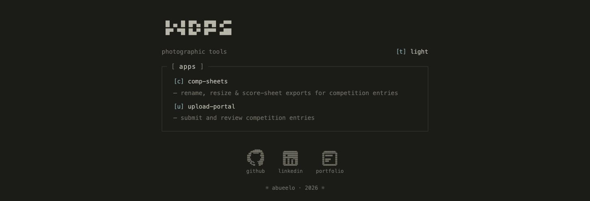
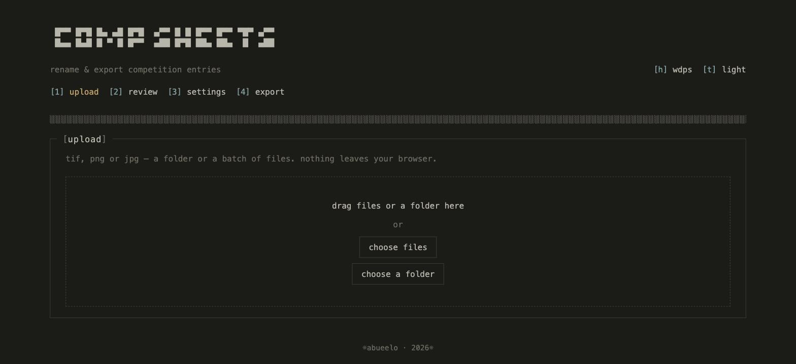
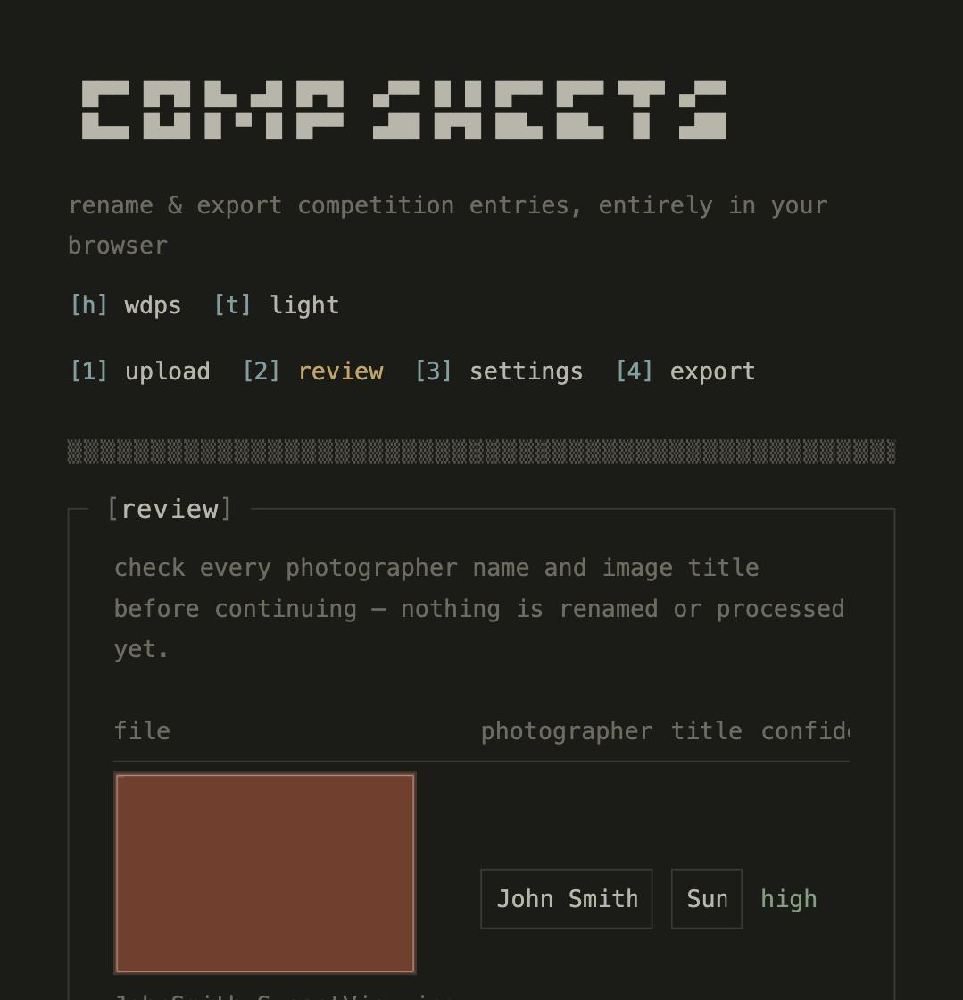
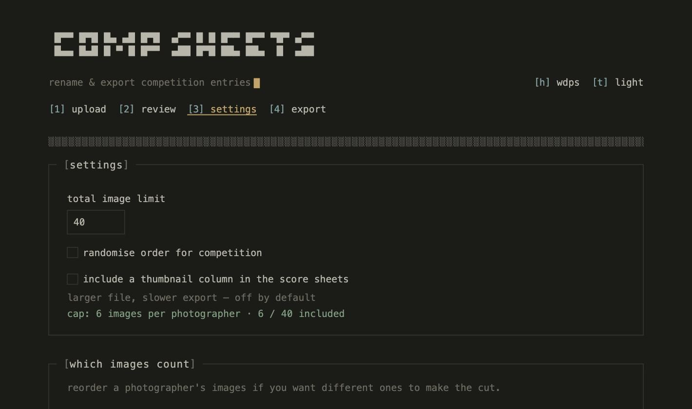
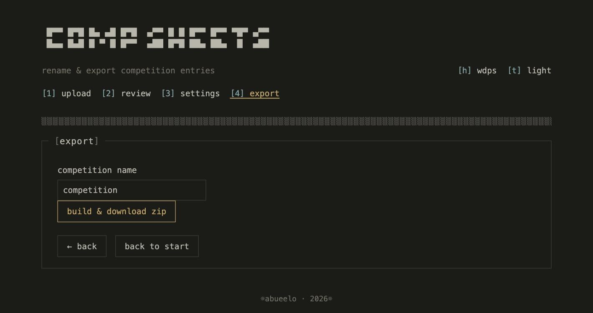

# wdps

Tools for the club's digital competitions, at [wdps.russl.dev](https://wdps.russl.dev).



## apps

### comp-sheets

Upload a batch of entries, fix up any names it guessed wrong, set a fair per-photographer limit, and export. Judge gets an anonymised set with no photographer names, scorer gets the full thing. Runs entirely in the browser — nothing gets uploaded anywhere, it's all canvas and web workers renaming/resizing locally, and a zip comes out the other end with the images plus both score sheets.

Drop in a folder or a batch of files:



It guesses the photographer and title from each filename (`01_Author_Title.jpg` is the expected convention) and flags anything it's not sure about for a manual check before continuing:



Set a total image limit and a per-photographer cap so no one floods the competition, then export:





### upload-portal

Lets members submit their own competition entries (title, name, image) instead of the organiser collecting them by hand. Admin reviews what came in, grouped by photographer, and can lock a competition, download it as a zip, or hand it straight off to comp-sheets. A GitHub-gated owner console sits above that — reset the admin/member passcodes, wipe the storage, see a log of what's happened — reachable from the "abueelo" link at the bottom of any page.

More apps can live in here later — see `packages/shared-bus` below.

## how it's put together

An npm workspaces monorepo:

- `apps/hub` — the landing page above, plain TS, no framework
- `apps/comp-sheets` — the actual tool, Svelte 5 + TypeScript
- `apps/upload-portal` — the entry-submission tool, Svelte 5 + TypeScript, member and admin views built from the same app
- `packages/shared-ui` — the terminal look (colours, fonts, buttons, the ascii banners) shared across apps, lifted straight from my [portfolio site](https://russl.dev)
- `packages/shared-bus` — lets apps in the suite hand images off to each other through IndexedDB, so a second app could pick up where comp-sheets left off — this is how upload-portal hands a locked competition's entries to comp-sheets
- `functions/` — Cloudflare Pages Functions backing upload-portal (competitions/entries API, KV + R2 storage). Everything else in the suite is a plain static build; this is the one app with a server side to it

## running it locally

Needs Node 18.17+.

```
npm install
npm run dev:hub            # hub on its own dev server
npm run dev:comp-sheets    # comp-sheets on its own dev server
npm run dev:upload-portal  # upload-portal on its own dev server (frontend only, no API)
npm run build               # builds everything into dist/
```

`npm run build` is what actually matters for testing the real thing — it assembles all three apps into one `dist/` tree the way they'll be served in production (hub at the root, the others under their own `/comp-sheets/` / `/upload-portal/` sub-paths), so serve that instead of relying on the separate dev servers if you want to check routing between them.

upload-portal's dev server alone doesn't have its API — that needs Cloudflare's local Functions runtime against real KV/R2 bindings, see [CLOUDFLARE.md](CLOUDFLARE.md).

## deploying

Cloudflare Pages, connected to GitHub. Full steps in [CLOUDFLARE.md](CLOUDFLARE.md).

Work happens on the `test` branch; `main` only gets merges when they're actually ready to go live, since that's what Pages deploys to production from.
